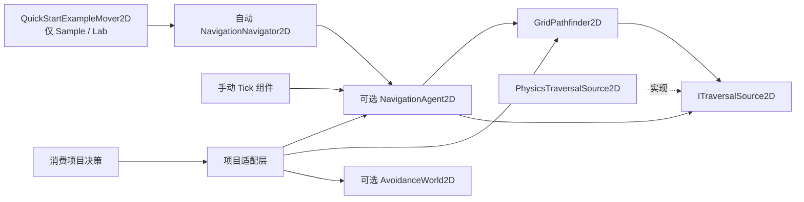
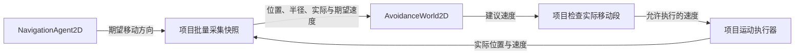

# 架构与数据归属

## 代码依赖

实线箭头从使用者指向被使用者；虚线箭头表示实现接口。项目快照采集与运动执行不属于包。

## 运行时数据流

下图箭头表示本步数据的传递方向，不表示代码依赖。项目先收集全部对象的快照，再统一求解并执行。

直接查询路线：调用方拥有输出列表与跟随状态；Agent 路线：代理唯一拥有目的地、路径、索引、重算时钟与到达状态。两条路线可选，同一角色不能并行维护两份权威状态。世界位置、速度、AI、空间层级与执行器属于项目。

一个 Runtime 程序集，继续使用 Vector2/Vector2Int。Agent 是普通 C# 类，组件是可选入口；Inspector 诊断位于独立 Editor 程序集，运行时不引用它。没有无需求的泛型 Core、3D 代码、反向 ARPG/Editor/测试/Sample/Lab 引用或友元。

每次查询重新读取障碍。搜索工作区和 Agent 路径缓冲复用；首轮容量扩容可分配，稳定后应零分配。只读视图创建一次。测量未显示必须改变原 A*，本轮通过代理请求节流减少不必要重算，不声称单次算法提速。

Sample 唯一正式源码位于 Samples~/BasicNavigation2D、Samples~/AgentNavigation2D、Samples~/CrowdNavigation2D 与 Samples~/QuickStartNavigation2D，分别展示直接查询、单角色代理、可选群体求解及 Inspector 导航与示例适配；消费者不必选择全部能力。Lab 同名导入副本由验证入口检查完整文件集合与哈希。

多层地图由消费者传入障碍源、有效性与版本。包不认识 World 或楼梯，层级提交与路线编排继续留在项目。3D 仅为未来方向。

局部避让与路径查询独立，可单独使用。AvoidanceWorld2D 仅复用本步工作缓冲，不建立第二份世界状态。ORCA 数学子集改编自固定 RVO2-CS 提交，版权、完整许可与修改说明见 Third Party Notices.md；不导入第三方全局模拟器或第三方公开类型。

战斗站位、攻击名额、跨层楼梯路线仍属于项目玩法。

自动组件路线：NavigationNavigator2D 唯一持有一个 Agent，路径和进度由 Agent 拥有；身体有附属 Rigidbody2D 时以该刚体物理位置推进，偏移身体的净空圆以相同锚点计算。手动 NavigationAgent2DComponent 也持有一个 Agent，跨物理场景保留任务并重新查询；同一角色不要并行驱动两种组件。正式 Runtime 没有移动执行器。QuickStartExampleMover2D 仅位于独立 Sample 程序集，用于演示消费建议；快速组件不隐含批量避让。详见 [Getting Started](GettingStarted.md) 与 [Inspector 指南](UnityGuide.md)。
