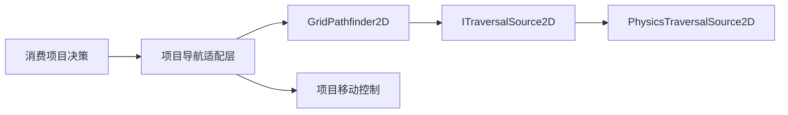

# 架构与数据归属

包只拥有搜索工作区。输出列表、目标、路径进度、重算时钟与速度属于消费者；世界位置属于消费项目的运动系统。不存在包级单例、隐藏全局地图或第二份角色状态。

一个 Runtime 程序集：算法通过 ITraversalSource2D 与 Physics2D 解耦，但公共坐标仍使用 Unity Vector2/Vector2Int，首版不额外引入纯 .NET 坐标模型。Runtime 不引用 Editor、测试、Sample、Lab 或游戏程序集。

每次查询重新读取障碍事实。节点记录、字典、最小堆和重建列表复用；数据结构首次扩容可以分配，容量稳定后查询不应产生持续分配。路径列表由调用方管理容量。

Sample 是最小可运行接入的权威演示源码；Lab 的 `Assets/Samples/BasicNavigation2D` 是受哈希校验的导入副本。修改 Sample 后必须同步并验证。Lab 自己的 Editor 工具与测试不随包运行时发布。

多层地图通过消费者选择不同障碍来源解决。包不理解层级 ID 或楼梯；未来跨层编排可以把入口、出口和终点拆成多次请求，并由消费者提交状态变化。首版没有跨层链接 API。
